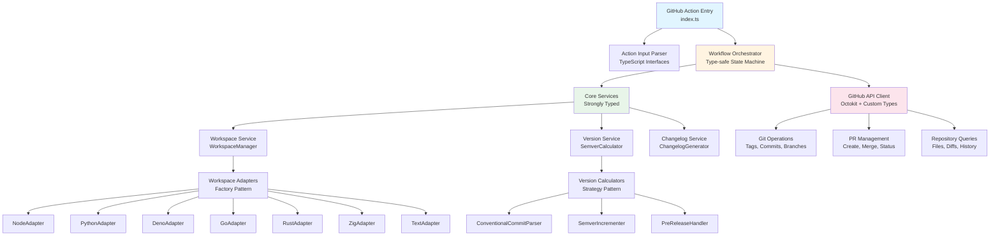
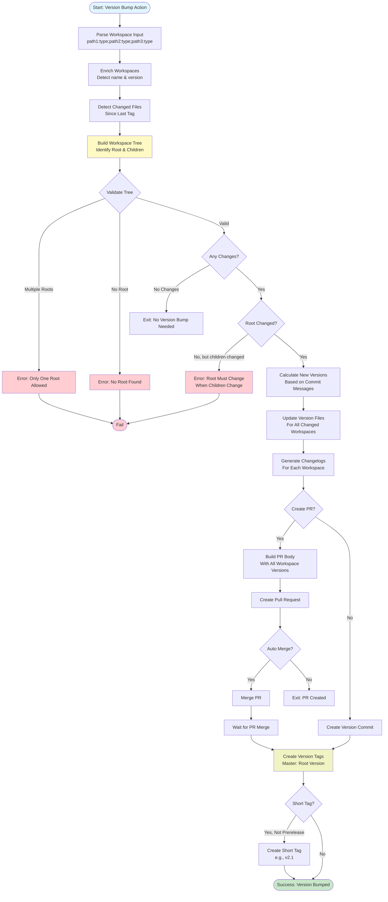

# High-Level Design: Bumpalicious TypeScript Migration & API-Based Approach

**Design ID**: HLD-001
**Service / Domain**: Bumpalicious GitHub Action
**Owner**: dragoscops
**Version**: v1.0 • **Date**: 2025-10-17 • **Status**: Draft
**Input**: Current JavaScript implementation analysis

## Document History

| Version | Date       | Summary of Change                       | Reference ID |
| ------: | ---------- | --------------------------------------- | ------------ |
|     1.0 | 2025-10-17 | Initial design for TypeScript migration | -            |

## Design Ownership (RACI-lite)

| Role                  | Responsibility                        | Named Individual |
| --------------------- | ------------------------------------- | ---------------- |
| Design Owner          | Owns HLD content/versioning; handover | dragoscops       |
| Architecture Reviewer | TypeScript migration patterns         | -                |
| Testing Lead          | Test coverage & migration validation  | -                |

## 1 Context

### 1.1 Summary

- **Service/system name**: Bumpalicious - Multi-language Monorepo Version Management GitHub Action
- **Change type**: Major Refactor & Enhancement
- **Business areas affected**: All users of the GitHub Action across multiple language ecosystems
- **Why now**:
  - Improve maintainability through TypeScript's type safety
  - Reduce git command complexity by leveraging `@actions/github` APIs
  - Better IDE support and developer experience
  - Align with GitHub Actions ecosystem standards
- **Expected outcomes**:
  - 100% type-safe codebase
  - Reduced runtime errors
  - Better API-based git operations
  - Improved testability
  - Enhanced documentation through types
- **Very high-level "how"**:
  - Migrate JavaScript codebase to TypeScript
  - Replace shell-based git operations with `@actions/github` and Octokit APIs
  - Implement comprehensive type definitions for workspace configurations
  - Maintain backward compatibility during transition
- **Criticality**: Medium (Active users depend on this action, but migration can be incremental)

### 1.2 Links to Documentation

- **Current implementation**: JavaScript modules in `/src-js`
- **Package.json**: Existing dependencies and build configuration
- **Action manifest**: `action.yml`
- **README.md**: User-facing documentation

## 2 Drivers, Requirements, Objectives

### 2.1 Drivers

- **Type Safety**: Eliminate runtime type errors through compile-time checking
- **Maintainability**: Make codebase easier to understand and modify
- **API-First Approach**: Replace shell command dependencies with robust API calls
- **Developer Experience**: Better autocomplete, refactoring, and documentation
- **Testing**: Easier to mock and test with type-safe interfaces
- **Ecosystem Alignment**: Most GitHub Actions are TypeScript-based

### 2.2 Requirements (Functional & Non-Functional)

**Functional Requirements**:

- FR-001: Support all existing workspace types (node, python, deno, go, rust, zig, text)
- FR-002: Maintain conventional commits-based version detection
- FR-003: Generate changelogs for each workspace
- FR-004: Support both PR-based and direct commit workflows
- FR-005: Handle monorepo structures with multiple workspaces
- FR-006: Support pre-release versioning (alpha, beta, rc)
- FR-007: Backward compatibility with existing action.yml inputs

**Non-Functional Requirements**:

- NFR-001: 100% type coverage (no `any` types in production code)
- NFR-002: Maintain or improve current performance
- NFR-003: Test coverage ≥ 80% for core logic
- NFR-004: Zero breaking changes for existing users
- NFR-005: Build output size ≤ 5MB (bundled with `@vercel/ncc`)
- NFR-006: Support Node.js 20+ (as per current engines requirement)

### 2.3 Objectives (SMART)

| ID     | Objective                           | Success Criteria                                |
| ------ | ----------------------------------- | ----------------------------------------------- |
| OBJ-01 | Complete TypeScript migration       | All `.js` files converted to `.ts`, builds pass |
| OBJ-02 | Replace git CLI with GitHub APIs    | 90% of git operations use Octokit APIs          |
| OBJ-03 | Implement comprehensive type system | All modules have complete type definitions      |
| OBJ-04 | Maintain test coverage              | Test coverage ≥ 80% after migration             |
| OBJ-05 | Zero regression in functionality    | All existing tests pass with TypeScript version |
| OBJ-06 | Publish v3.0.0 within 8 weeks       | Tagged release with migration notes             |

### 2.4 Impact of No Action

- Continued accumulation of runtime errors
- Difficulty onboarding new contributors
- Increased maintenance burden
- Potential security issues from shell command injection
- Missed opportunities for better error handling
- Growing technical debt

## 3 Assumptions, Constraints, Dependencies

### 3.1 Assumptions

| Assumption                                 | Impact on Design                            |
| ------------------------------------------ | ------------------------------------------- |
| Node.js 20+ is standard for GitHub Actions | Can use modern TypeScript features          |
| Users will accept major version bump (v3)  | Can introduce breaking changes if needed    |
| Octokit APIs cover all required git ops    | May need fallback to git CLI for edge cases |
| Build time increase acceptable (<2x)       | TypeScript compilation adds overhead        |
| Existing test suite is comprehensive       | Can validate migration correctness          |

### 3.2 Constraints

- **Funding**: Open source project (no budget constraints)
- **Skills/resources**: Solo or small team development
- **Existing tech lock-in**: Must maintain compatibility with GitHub Actions ecosystem
- **Timescales**: Gradual migration preferred over big-bang rewrite
- **Customer process rigidity**: Cannot break existing workflows without major version bump
- **Build tooling**: Must use `@vercel/ncc` for bundling (GitHub Actions requirement)

### 3.3 Dependencies

- **TypeScript compiler**: 5.0+ for modern features
- **@actions/core**: Core GitHub Actions toolkit
- **@actions/github**: GitHub API interactions
- **@octokit/rest**: Enhanced GitHub REST API client
- **Existing dependencies**: semver, conventional-changelog, pino, etc.
- **Testing framework**: Vitest (already in use)
- **Build system**: Must integrate with existing npm scripts

## 4 Current State

### 4.1 Logical / Architectural Summary

**Current Architecture** (JavaScript):

```
┌─────────────────────────────────────────────────────────────┐
│                    GitHub Action Entry                      │
│                      (src/index.js)                         │
└───────────────────────┬─────────────────────────────────────┘
                        │
        ┌───────────────┴────────────────┐
        │                                │
┌───────▼────────┐              ┌────────▼────────┐
│  Core Modules  │              │  Utils Modules  │
│                │              │                 │
│ • workspaces   │              │ • git (CLI)     │
│ • version      │              │ • github        │
│ • detect       │◄─────────────┤ • changelog     │
│ • update       │              │ • workspace     │
└────────┬───────┘              │ • logging       │
         │                      │ • exec          │
         │                      └─────────────────┘
         │
┌────────▼─────────────────────────────────────┐
│      Workspace Type Handlers                 │
│                                              │
│  node • python • deno • go • rust • zig     │
│  text (fallback)                            │
└──────────────────────────────────────────────┘
```

**Key Components**:

1. **Entry Point** (`index.js`): Main workflow orchestration
2. **Core Logic**:
   - `workspaces.js`: Workspace detection and version management
   - `version.js`: Semver calculation based on conventional commits
   - `detect.js`: Generic file parsing framework
   - `update.js`: Generic file update framework
3. **Utilities**:
   - `git.js`: Shell-based git operations (tags, commits, branches)
   - `github.js`: PR creation using Octokit
   - `changelog.js`: Conventional changelog generation
   - `workspace.js`: Tree structure for workspace dependencies
4. **Workspace Handlers**: Language-specific detection/update logic

### 4.2 Current Limitations

| ID     | Limitation                          | Impact                                    |
| ------ | ----------------------------------- | ----------------------------------------- |
| LIM-01 | No compile-time type checking       | Runtime errors, harder to refactor        |
| LIM-02 | Shell command-based git operations  | Security risks, error handling complexity |
| LIM-03 | Implicit interfaces between modules | Unclear contracts, integration bugs       |
| LIM-04 | JSDoc annotations incomplete        | Poor IDE support, maintenance difficulty  |
| LIM-05 | Mixed async/sync error handling     | Inconsistent error propagation            |
| LIM-06 | Limited workspace type validation   | Invalid configurations caught at runtime  |

## 5 Target Architecture

### 5.1 Options Considered

**Option 1: Big-Bang Rewrite** ❌

- Convert everything at once
- High risk, long testing cycle
- Blocks other development

**Option 2: Gradual Migration with Dual Support** ⚠️

- Support both .js and .ts during transition
- Complex build configuration
- Longer transition period

**Option 3: Module-by-Module Migration** ✅ **SELECTED**

- Start with type definitions
- Migrate utilities first, then core logic
- Test incrementally
- Lower risk, continuous delivery

**Option 4: Parallel v3 Branch** ❌

- Maintain two codebases
- High maintenance burden
- Divergence issues

**Rationale**: Option 3 provides best balance of risk mitigation, continuous testing, and maintainability.

### 5.2 Logical Target Design



### 5.3 Workspace Tree Processing Flow



**Key Architectural Changes**:

1. **Type System**:
   - Strict TypeScript configuration (`strict: true`)
   - No implicit `any` types
   - Comprehensive interfaces for all data structures
   - Branded types for version strings, paths, etc.

2. **API-Based Git Operations**:
   - Replace shell `git` commands with Octokit API calls
   - Use `@actions/github` for authenticated operations
   - Implement retry logic and rate limiting
   - Better error handling with typed exceptions

3. **Service-Oriented Architecture**:
   - Clear service boundaries with interfaces
   - Dependency injection for testability
   - Factory pattern for workspace adapters
   - Strategy pattern for version calculations

4. **Enhanced Error Handling**:
   - Custom error classes with type guards
   - Result types for fallible operations
   - Comprehensive logging with correlation IDs

### 5.3 Physical Solution Summary

**Technology Stack**:

- **Language**: TypeScript 5.0+
- **Runtime**: Node.js 20+
- **Build Tool**: `tsc` + `@vercel/ncc` (bundler)
- **Package Manager**: npm (existing)
- **Testing**: Vitest (existing)
- **Linting**: ESLint with TypeScript plugin
- **Formatting**: Prettier (existing)

**Key Libraries**:

1. **GitHub Integration**:
   - `@actions/core@^1.10.1` (existing)
   - `@actions/github@^6.0.0` (existing)
   - `@octokit/rest` (upgrade to latest)
   - `@octokit/types` (for type definitions)

2. **Version Management**:
   - `semver@^7.6.0` (existing) + `@types/semver`
   - `conventional-commits-parser@^5.0.0` (new)
   - `conventional-changelog-core@^9.0.0` (existing)

3. **Utilities**:
   - `zod@^3.22.0` (runtime validation)
   - `ts-pattern@^5.0.0` (pattern matching)
   - `fp-ts@^2.16.0` (functional programming utilities) - OPTIONAL

4. **Development**:
   - `@templ-project/tsconfig@^0.4.2` (shared TypeScript configuration)
   - `typescript@^5.9.3` (included via @templ-project/tsconfig)
   - `@types/node@^20.0.0`
   - `ts-node@^10.9.0` (for scripts)
   - `vitest@latest` (upgrade)

**Module Structure** (TypeScript):

```
src/
├── index.ts                          # Entry point
├── index.spec.ts                     # Unit tests for index
├── types/                            # Shared type definitions
│   ├── action.ts                    # Action input/output types
│   ├── workspace.ts                 # Workspace interfaces
│   ├── version.ts                   # Version types
│   └── git.ts                       # Git operation types
├── core/
│   ├── WorkspaceManager.ts          # Main workspace orchestration
│   ├── WorkspaceManager.spec.ts     # Unit tests
│   ├── VersionService.ts            # Version calculation
│   ├── VersionService.spec.ts       # Unit tests
│   ├── ChangelogService.ts          # Changelog generation
│   ├── ChangelogService.spec.ts     # Unit tests
│   ├── fixtures/                    # Test fixtures for core
│   │   ├── workspaces.ts
│   │   └── versions.ts
│   └── adapters/                    # Workspace type adapters
│       ├── BaseAdapter.ts           # Abstract base
│       ├── BaseAdapter.spec.ts      # Unit tests
│       ├── NodeAdapter.ts
│       ├── NodeAdapter.spec.ts      # Unit tests
│       ├── PythonAdapter.ts
│       ├── PythonAdapter.spec.ts    # Unit tests
│       ├── DenoAdapter.ts
│       ├── DenoAdapter.spec.ts      # Unit tests
│       ├── GoAdapter.ts
│       ├── GoAdapter.spec.ts        # Unit tests
│       ├── RustAdapter.ts
│       ├── RustAdapter.spec.ts      # Unit tests
│       ├── ZigAdapter.ts
│       ├── ZigAdapter.spec.ts       # Unit tests
│       ├── TextAdapter.ts
│       ├── TextAdapter.spec.ts      # Unit tests
│       └── fixtures/                # Adapter test fixtures
│           ├── package.json
│           ├── pyproject.toml
│           └── Cargo.toml
├── services/
│   ├── GitHubService.ts             # GitHub API wrapper
│   ├── GitHubService.spec.ts        # Unit tests
│   ├── GitOperations.ts             # Git operations via API
│   ├── GitOperations.spec.ts        # Unit tests
│   ├── PRService.ts                 # Pull request management
│   ├── PRService.spec.ts            # Unit tests
│   ├── RepositoryService.ts         # Repository queries
│   ├── RepositoryService.spec.ts    # Unit tests
│   └── fixtures/                    # Service test fixtures
│       └── octokit-mocks.ts
├── parsers/
│   ├── ConventionalCommitParser.ts  # Parse commit messages
│   ├── ConventionalCommitParser.spec.ts  # Unit tests
│   ├── FileParser.ts                # Generic file parsing
│   ├── FileParser.spec.ts           # Unit tests
│   ├── ConfigParser.ts              # Config file parsers
│   ├── ConfigParser.spec.ts         # Unit tests
│   └── fixtures/                    # Parser test fixtures
│       ├── commit-messages.ts
│       └── config-files.ts
├── utils/
│   ├── logger.ts                    # Structured logging
│   ├── logger.spec.ts               # Unit tests
│   ├── errors.ts                    # Custom error classes
│   ├── errors.spec.ts               # Unit tests
│   ├── validators.ts                # Input validation (Zod)
│   ├── validators.spec.ts           # Unit tests
│   ├── retry.ts                     # Retry logic
│   └── retry.spec.ts                # Unit tests
test/                                # Integration tests
├── workflows/
│   ├── version-bump.test.ts         # Full version bump workflow
│   ├── pr-creation.test.ts          # PR creation flow
│   └── monorepo.test.ts             # Monorepo scenarios
├── e2e/
│   ├── single-workspace.test.ts     # Single workspace scenarios
│   └── multi-workspace.test.ts      # Multi-workspace scenarios
└── fixtures/                        # Integration test fixtures
    ├── repos/                       # Mock repository structures
    │   ├── node-project/
    │   ├── python-project/
    │   └── monorepo/
    └── mocks/
        └── github-api.ts
```

### 5.4 Migration Strategy

**Phase 1: Foundation** (Week 1-2)

- Set up TypeScript configuration
- Create core type definitions
- Migrate utility modules (logger, errors, validators)
- Set up dual build process (JS + TS)

**Phase 2: Services** (Week 3-4)

- Migrate GitHubService (replace git CLI operations)
- Implement API-based git operations
- Migrate changelog service
- Update tests for services

**Phase 3: Core Logic** (Week 5-6)

- Migrate workspace adapters
- Migrate version calculation
- Implement WorkspaceManager
- Comprehensive integration tests

**Phase 4: Entry Point & Polish** (Week 7-8)

- Migrate index.ts
- Remove all JavaScript files
- Documentation updates
- Performance optimization
- Final testing & release

## 6 Service Continuity & NFRs

### 6.1 Criticality & SLOs

- **Criticality**: Medium (GitHub Action, not critical infrastructure)
- **Availability target**: 99.9% (dependent on GitHub Actions platform)
- **Performance targets**:
  - Single workspace version bump: < 30 seconds
  - Monorepo (10 workspaces): < 2 minutes
  - Memory usage: < 512MB
  - Build time: < 60 seconds

### 6.2 Backward Compatibility

- **Action inputs**: 100% backward compatible (same `action.yml`)
- **Behavior**: Identical output for same inputs
- **Migration path**: Users update `uses:` version, no config changes required

### 6.3 Failure Modes & Response

| Failure Mode              | Required Function     | High-Level Process                   |
| ------------------------- | --------------------- | ------------------------------------ |
| GitHub API rate limit     | Continue with git CLI | Fallback to shell commands           |
| Network timeout           | Retry with backoff    | Exponential backoff (3 retries)      |
| Invalid workspace config  | Fail with clear error | Validate early, show helpful message |
| Permission denied         | Fail fast             | Check permissions before operations  |
| Changelog generation fail | Warn and continue     | Non-blocking, log warning            |

## 7 Security & Compliance

### 7.1 Security Improvements

1. **No Shell Injection**:
   - Eliminate shell command execution where possible
   - Use API calls for git operations
   - Validate all inputs before use

2. **Type Safety**:
   - Prevent type confusion attacks
   - Validate workspace configurations with Zod
   - Sanitize file paths

3. **Secret Handling**:
   - Use `@actions/core` for secret masking
   - Never log tokens or sensitive data
   - Secure token storage in memory

4. **Dependencies**:
   - Regular security audits with `npm audit`
   - Automated Dependabot updates
   - Pin major versions

### 7.2 Data Protection

- **GitHub Token**: Masked in logs, stored securely
- **Repository Data**: Read-only by default, write operations explicit
- **User Data**: No PII collected or stored

## 8 Technical Design Details

### 8.1 Workspace Tree Architecture

**Critical Design Principle**: The workspace hierarchy determines version propagation and the master version tag.

#### 8.1.1 Workspace Tree Structure

The `workspaces` input uses a **hierarchical path-based ordering**:

```yaml
# Format: "path1:type;path2:type;path3:type"
workspaces: ".:node;packages/api:python;packages/ui:node"
```

**Hierarchy Rules**:

1. **Root Workspace** (`.` or shortest path):
   - MUST be the first workspace in the list
   - Its version becomes the **master version tag** (e.g., `v2.1.0`)
   - Only ONE root workspace allowed per execution

2. **Child Workspaces** (nested paths):
   - All paths that start with the root path
   - Can have independent versions
   - Changes propagate UP to root

3. **Version Propagation Rule**:
   - If ANY child workspace changes → Root workspace MUST change
   - If NO child workspaces change → Root workspace MAY change (if root files changed)
   - If root doesn't change but children do → **ERROR: No root version found**

#### 8.1.2 Type System Design

```typescript
// Core type definitions

/** Branded type for version strings */
type Version = string & {readonly __brand: "Version"};

/** Workspace configuration (parsed from input) */
interface WorkspaceConfig {
  readonly path: string;
  readonly type: WorkspaceType;
  readonly name?: string;
  readonly version?: Version;
}

/** Workspace with enriched metadata */
interface Workspace extends WorkspaceConfig {
  readonly name: string; // Required after detection
  readonly version: Version; // Required after detection
  readonly hasChanges: boolean;
  readonly filesChanged: ReadonlyArray<string>;
}

/** Workspace tree node for hierarchy */
interface WorkspaceNode {
  readonly workspace: Workspace;
  readonly children: ReadonlyArray<WorkspaceNode>;
  readonly depth: number;
  readonly isRoot: boolean;
}

/** Workspace tree (single root) */
interface WorkspaceTree {
  readonly root: WorkspaceNode;
  readonly allNodes: ReadonlyArray<WorkspaceNode>;
  readonly changedNodes: ReadonlyArray<WorkspaceNode>;
  readonly masterVersion: Version; // Root's version
}

/** Supported workspace types */
type WorkspaceType = "node" | "python" | "deno" | "go" | "rust" | "zig" | "text";

/** Action inputs (validated) */
interface ActionInputs {
  readonly workspaces: ReadonlyArray<WorkspaceConfig>;
  readonly branch: string;
  readonly pr: boolean;
  readonly prAutoMerge: boolean;
  readonly prMessage: string;
  readonly prVersionPrefix: string;
  readonly shortTag: boolean;
  readonly changelogPreset: ChangelogPreset;
  readonly githubToken: string;
}

/** Result type for fallible operations */
type Result<T, E = Error> = {success: true; data: T} | {success: false; error: E};

/** Commit message analysis */
interface CommitAnalysis {
  readonly type: "major" | "minor" | "patch" | "none";
  readonly preRelease?: string;
  readonly breaking: boolean;
  readonly scope?: string;
  readonly description: string;
}
```

#### 8.1.3 Workspace Tree Building Algorithm

```typescript
// WorkspaceTreeBuilder.ts
class WorkspaceTreeBuilder {
  /**
   * Build workspace tree from flat workspace list
   * Validates hierarchy and ensures single root
   */
  build(workspaces: ReadonlyArray<Workspace>): Result<WorkspaceTree> {
    // Step 1: Validate at least one workspace
    if (workspaces.length === 0) {
      return {
        success: false,
        error: new InvalidConfigurationError("No workspaces provided"),
      };
    }

    // Step 2: Identify root workspace (shortest path, typically ".")
    const sortedByPath = [...workspaces].sort((a, b) => a.path.length - b.path.length);
    const rootWorkspace = sortedByPath[0];

    // Step 3: Validate only one root
    const otherRoots = sortedByPath.filter((w) => w !== rootWorkspace && !w.path.startsWith(rootWorkspace.path + "/"));

    if (otherRoots.length > 0) {
      return {
        success: false,
        error: new InvalidConfigurationError(
          `Multiple root workspaces detected. Only one root allowed. Found: ${rootWorkspace.path}, ${otherRoots.map((w) => w.path).join(", ")}`,
        ),
      };
    }

    // Step 4: Build tree recursively
    const rootNode = this.buildNode(rootWorkspace, workspaces, 0, true);

    // Step 5: Collect all nodes (flattened)
    const allNodes = this.flattenTree(rootNode);

    // Step 6: Filter changed nodes
    const changedNodes = allNodes.filter((node) => node.workspace.hasChanges);

    // Step 7: Validate root changed if any children changed
    const childrenChanged = changedNodes.some((node) => !node.isRoot);
    const rootChanged = changedNodes.some((node) => node.isRoot);

    if (childrenChanged && !rootChanged) {
      return {
        success: false,
        error: new WorkspaceValidationError(
          "Child workspaces changed but root workspace unchanged. " +
            "Root workspace must have changes when children change.",
        ),
      };
    }

    // Step 8: Return tree
    return {
      success: true,
      data: {
        root: rootNode,
        allNodes,
        changedNodes,
        masterVersion: rootNode.workspace.version,
      },
    };
  }

  private buildNode(
    workspace: Workspace,
    allWorkspaces: ReadonlyArray<Workspace>,
    depth: number,
    isRoot: boolean,
  ): WorkspaceNode {
    // Find direct children (paths that start with current path + "/")
    const children = allWorkspaces
      .filter((w) => {
        const relativePath = w.path.replace(workspace.path + "/", "");
        return (
          w !== workspace && w.path.startsWith(workspace.path + "/") && !relativePath.includes("/") // Direct child only
        );
      })
      .map((child) => this.buildNode(child, allWorkspaces, depth + 1, false));

    return {
      workspace,
      children,
      depth,
      isRoot,
    };
  }

  private flattenTree(node: WorkspaceNode): ReadonlyArray<WorkspaceNode> {
    return [node, ...node.children.flatMap((child) => this.flattenTree(child))];
  }
}
```

#### 8.1.4 Workspace Input Parsing

```typescript
// Parse workspaces input from action.yml
function parseWorkspacesInput(input: string): ReadonlyArray<WorkspaceConfig> {
  // Format: "path1:type;path2:type" or "path1:type,path2:type"
  const separator = input.includes(";") ? ";" : ",";

  return input
    .split(separator)
    .map((entry) => entry.trim())
    .filter(Boolean)
    .map((entry) => {
      const [path, type] = entry.split(":").map((s) => s.trim());

      if (!path || !type) {
        throw new InvalidConfigurationError(`Invalid workspace format: "${entry}". Expected "path:type"`);
      }

      return {
        path: path === "." ? "." : path.replace(/^\.\//, ""), // Normalize "./" to ""
        type: type as WorkspaceType,
      };
    });
}
```

### 8.2 Version Tag and PR Body Generation

#### 8.2.1 Master Version Tag

The **root workspace version** becomes the primary Git tag:

```typescript
// Example: Root workspace at "." with version 2.1.0
// Tag created: v2.1.0

async function createMasterTag(tree: WorkspaceTree, options: ActionInputs): Promise<Result<void>> {
  const tagName = `v${tree.masterVersion}`;
  const tagMessage = buildTagMessage(tree);

  // Create main version tag
  await gitOperations.createTag(tagName, tagMessage);

  // Optionally create short tag (e.g., v2.1 for v2.1.0)
  if (options.shortTag && !isPreRelease(tree.masterVersion)) {
    const shortVersion = getShortVersion(tree.masterVersion); // "2.1.0" -> "2.1"
    await gitOperations.createTag(`v${shortVersion}`, tagMessage);
  }
}

function buildTagMessage(tree: WorkspaceTree): string {
  const lines = [`chore: version bump to ${tree.masterVersion}`, "", "Updated workspaces:"];

  for (const node of tree.changedNodes) {
    lines.push(`  - ${node.workspace.name}: ${node.workspace.version}`);
  }

  return lines.join("\n");
}
```

#### 8.2.2 Pull Request Body with Workspace Versions

When creating a PR, include all workspace versions in the body:

```typescript
async function createVersionPR(tree: WorkspaceTree, options: ActionInputs): Promise<Result<PRCreateResponse>> {
  const prTitle = `${options.prMessage} ${tree.masterVersion}`;

  // Build PR body with workspace breakdown
  const prBody = buildPRBody(tree);

  const result = await prService.create({
    title: prTitle,
    body: prBody,
    base: options.branch,
    head: `${options.prVersionPrefix}_v${tree.masterVersion}`,
  });

  return result;
}

function buildPRBody(tree: WorkspaceTree): string {
  const sections: string[] = [
    `# Version Update: ${tree.root.workspace.name} ${tree.masterVersion}`,
    "",
    "## 📦 Workspace Versions",
    "",
  ];

  // Root workspace
  sections.push(`### 🏠 Root: ${tree.root.workspace.name}`);
  sections.push(`**Version**: \`${tree.root.workspace.version}\`  `);
  sections.push(`**Path**: \`${tree.root.workspace.path}\`  `);
  sections.push(`**Type**: \`${tree.root.workspace.type}\`  `);
  sections.push("");

  // Child workspaces (if any)
  if (tree.root.children.length > 0) {
    sections.push("### 📁 Child Workspaces");
    sections.push("");

    for (const child of tree.root.children) {
      sections.push(...formatWorkspaceNode(child, 0));
    }
  }

  // Changelogs section
  sections.push("## 📝 Changelogs");
  sections.push("");

  for (const node of tree.changedNodes) {
    sections.push(`### ${node.workspace.name} (${node.workspace.version})`);
    sections.push("");

    // Include changelog excerpt
    const changelogExcerpt = await readChangelogExcerpt(node.workspace);
    if (changelogExcerpt) {
      sections.push(changelogExcerpt);
    } else {
      sections.push("_No changelog available_");
    }
    sections.push("");
  }

  return sections.join("\n");
}

function formatWorkspaceNode(node: WorkspaceNode, indentLevel: number): string[] {
  const indent = "  ".repeat(indentLevel);
  const changeIndicator = node.workspace.hasChanges ? "🔄" : "✓";

  const lines = [
    `${indent}- ${changeIndicator} **${node.workspace.name}** \`${node.workspace.version}\``,
    `${indent}  - Path: \`${node.workspace.path}\``,
    `${indent}  - Type: \`${node.workspace.type}\``,
  ];

  // Recursively add children
  if (node.children.length > 0) {
    for (const child of node.children) {
      lines.push(...formatWorkspaceNode(child, indentLevel + 1));
    }
  }

  return lines;
}

async function readChangelogExcerpt(workspace: Workspace): Promise<string | null> {
  const changelogPath = join(workspace.path, "CHANGELOG.md");

  try {
    const content = await readFile(changelogPath, "utf-8");
    // Extract latest version section
    const sections = content.split(/^## /m);
    return sections[1] ? `## ${sections[1]}` : null;
  } catch {
    return null;
  }
}
```

**Example PR Body Output**:

```markdown
# Version Update: my-monorepo 2.1.0

## 📦 Workspace Versions

### 🏠 Root: my-monorepo

**Version**: `2.1.0`
**Path**: `.`
**Type**: `node`

### 📁 Child Workspaces

- 🔄 **api-service** `1.5.0`
  - Path: `packages/api`
  - Type: `python`
- 🔄 **ui-components** `3.2.1`
  - Path: `packages/ui`
  - Type: `node`
  - ✓ **shared-utils** `1.0.5`
    - Path: `packages/ui/utils`
    - Type: `node`

## 📝 Changelogs

### my-monorepo (2.1.0)

## [2.1.0] - 2025-10-17

### Features

- Add new workspace structure
- Implement hierarchical versioning

### api-service (1.5.0)

## [1.5.0] - 2025-10-17

### Features

- Add authentication endpoints
- Improve error handling
```

### 8.3 API-Based Git Operations

**Current (Shell-based)**:

```javascript
// git.js
async function createTag(tagName, message) {
  await exec("git", ["tag", "-a", tagName, "-m", message]);
}
```

**Target (API-based)**:

```typescript
// GitOperations.ts
class GitOperations {
  constructor(
    private readonly octokit: Octokit,
    private readonly repo: {owner: string; repo: string},
  ) {}

  async createTag(tagName: string, message: string, commitSha: string): Promise<Result<GitTag>> {
    try {
      const {data} = await this.octokit.git.createTag({
        ...this.repo,
        tag: tagName,
        message,
        object: commitSha,
        type: "commit",
      });

      // Create reference
      await this.octokit.git.createRef({
        ...this.repo,
        ref: `refs/tags/${tagName}`,
        sha: data.sha,
      });

      return {success: true, data};
    } catch (error) {
      return {
        success: false,
        error: new GitOperationError("Failed to create tag", error),
      };
    }
  }
}
```

### 8.4 Changelog Integration with Workspace Tree

Each workspace gets its own CHANGELOG.md, but the root changelog should reference child changes:

```typescript
async function generateWorkspaceChangelogs(tree: WorkspaceTree): Promise<void> {
  // Generate changelog for each changed workspace
  for (const node of tree.changedNodes) {
    await changelogService.generate(node.workspace);
  }

  // For root workspace, add summary of child changes
  if (tree.root.children.length > 0 && tree.root.workspace.hasChanges) {
    await appendChildSummaryToRootChangelog(tree);
  }
}

async function appendChildSummaryToRootChangelog(tree: WorkspaceTree): Promise<void> {
  const changelogPath = join(tree.root.workspace.path, "CHANGELOG.md");
  const content = await readFile(changelogPath, "utf-8");

  // Find the latest version section
  const sections = content.split(/^## /m);
  if (sections.length < 2) return;

  // Add child workspace summary
  const childSummary = [
    "",
    "### Child Workspace Updates",
    "",
    ...tree.root.children
      .filter((child) => child.workspace.hasChanges)
      .map((child) => `- **${child.workspace.name}**: ${child.workspace.version}`),
  ].join("\n");

  // Insert after the first section
  const updatedContent = `${sections[0]}## ${sections[1]}${childSummary}\n\n## ${sections.slice(2).join("## ")}`;

  await writeFile(changelogPath, updatedContent, "utf-8");
}
```

### 8.5 Workspace Adapter Pattern

```typescript
// BaseAdapter.ts
abstract class BaseWorkspaceAdapter {
  abstract readonly type: WorkspaceType;
  abstract readonly supportedFiles: ReadonlyArray<string>;

  abstract detect(path: string): Promise<Result<ProjectInfo>>;
  abstract update(path: string, version: Version): Promise<Result<void>>;

  protected abstract createParser(filePath: string): FileParser;
  protected abstract createUpdater(filePath: string): FileUpdater;
}

// NodeAdapter.ts
class NodeAdapter extends BaseWorkspaceAdapter {
  readonly type = "node" as const;
  readonly supportedFiles = ["package.json", "jsr.json"] as const;

  async detect(path: string): Promise<Result<ProjectInfo>> {
    // Type-safe file detection
    for (const file of this.supportedFiles) {
      const filePath = join(path, file);
      const parser = this.createParser(filePath);
      const result = await parser.parse();

      if (result.success && result.data.version) {
        return result;
      }
    }

    return {
      success: false,
      error: new DetectionError("No version found"),
    };
  }

  protected createParser(filePath: string): FileParser {
    return new JsonFileParser(filePath, {
      version: ["version"],
      name: ["name"],
    });
  }
}
```

### 8.6 Error Handling Design

```typescript
// errors.ts
abstract class BumpaliciousError extends Error {
  abstract readonly code: string;
  abstract readonly recoverable: boolean;

  constructor(
    message: string,
    public readonly cause?: unknown,
  ) {
    super(message);
    this.name = this.constructor.name;
  }
}

class GitOperationError extends BumpaliciousError {
  readonly code = "GIT_OPERATION_FAILED";
  readonly recoverable = true;
}

class WorkspaceDetectionError extends BumpaliciousError {
  readonly code = "WORKSPACE_DETECTION_FAILED";
  readonly recoverable = false;
}

class InvalidConfigurationError extends BumpaliciousError {
  readonly code = "INVALID_CONFIGURATION";
  readonly recoverable = false;
}

// Type guard
function isRecoverableError(error: unknown): error is BumpaliciousError {
  return error instanceof BumpaliciousError && error.recoverable;
}
```

### 8.7 Workspace Tree Validation Errors

```typescript
class WorkspaceValidationError extends BumpaliciousError {
  readonly code = "WORKSPACE_VALIDATION_FAILED";
  readonly recoverable = false;

  constructor(
    message: string,
    public readonly details?: Record<string, unknown>,
  ) {
    super(message);
  }
}

// Specific validation errors
const VALIDATION_ERRORS = {
  NO_ROOT_FOUND: "No root workspace found. Ensure first workspace is the root (typically '.')",
  MULTIPLE_ROOTS: "Multiple root workspaces detected. Only one root workspace allowed per execution.",
  ROOT_UNCHANGED_CHILDREN_CHANGED:
    "Child workspaces changed but root workspace unchanged. Root must change when children change.",
  INVALID_HIERARCHY: "Workspace paths do not form a valid hierarchy.",
  EMPTY_WORKSPACE_LIST: "No workspaces provided.",
} as const;
```

### 8.8 Input Validation with Zod

```typescript
// validators.ts
import {z} from "zod";

const WorkspaceTypeSchema = z.enum(["node", "python", "deno", "go", "rust", "zig", "text"]);

const WorkspaceConfigSchema = z.object({
  path: z.string().min(1),
  type: WorkspaceTypeSchema,
  name: z.string().optional(),
  version: z.string().optional(),
});

const ActionInputsSchema = z.object({
  workspaces: z.array(WorkspaceConfigSchema).min(1),
  branch: z.string().default("main"),
  pr: z.boolean().default(false),
  prAutoMerge: z.boolean().default(false),
  prMessage: z.string().default("chore: version update"),
  prVersionPrefix: z.string().default("version_bump"),
  shortTag: z.boolean().default(false),
  changelogPreset: z.string().default("conventionalcommits"),
  githubToken: z.string().min(1),
});

export function validateInputs(raw: unknown): ActionInputs {
  return ActionInputsSchema.parse(raw);
}
```

## 9 Testing Strategy

### 9.1 Test Organization

**Unit Tests** (`.spec.ts`):

- Located **next to source files** in the same directory
- Fast, isolated tests for individual functions/classes
- Mock all external dependencies
- Focus on single unit of functionality

**Integration Tests** (`.test.ts`):

- Located in `test/` directory
- Test multiple components working together
- May use real file system, but mock GitHub API
- Test workflows and complete features

**Fixtures**:

- **Source fixtures**: In `src/*/fixtures/` for unit tests (e.g., `src/core/fixtures/`)
- **Integration fixtures**: In `test/fixtures/` for integration tests
- Include mock repositories, API responses, configuration files

### 9.2 Test Coverage Goals

- **Unit Tests**: ≥ 85% coverage
- **Integration Tests**: All critical paths (workflows, error scenarios)
- **Type Tests**: Type-level validation with `tsd` (optional)

### 9.3 Unit Test Examples

```typescript
// src/core/adapters/NodeAdapter.spec.ts
import {describe, it, expect, beforeEach} from "vitest";
import {NodeAdapter} from "./NodeAdapter";
import {join} from "node:path";

describe("NodeAdapter", () => {
  let adapter: NodeAdapter;
  const fixturesPath = join(__dirname, "fixtures");

  beforeEach(() => {
    adapter = new NodeAdapter();
  });

  it("should detect version from package.json", async () => {
    const projectPath = join(fixturesPath, "node-project");
    const result = await adapter.detect(projectPath);

    expect(result.success).toBe(true);
    if (result.success) {
      expect(result.data.version).toBe("1.2.3");
      expect(result.data.name).toBe("my-package");
    }
  });

  it("should return error when no package.json found", async () => {
    const projectPath = join(fixturesPath, "empty-project");
    const result = await adapter.detect(projectPath);

    expect(result.success).toBe(false);
    if (!result.success) {
      expect(result.error.code).toBe("WORKSPACE_DETECTION_FAILED");
    }
  });
});
```

```typescript
// src/parsers/ConventionalCommitParser.spec.ts
import {describe, it, expect} from "vitest";
import {ConventionalCommitParser} from "./ConventionalCommitParser";
import {commitMessages} from "./fixtures/commit-messages";

describe("ConventionalCommitParser", () => {
  const parser = new ConventionalCommitParser();

  it("should parse feat commit as minor", () => {
    const result = parser.parse("feat: add new feature");

    expect(result.type).toBe("minor");
    expect(result.breaking).toBe(false);
  });

  it("should parse breaking change", () => {
    const result = parser.parse("feat!: breaking change");

    expect(result.type).toBe("major");
    expect(result.breaking).toBe(true);
  });

  it("should extract pre-release identifier", () => {
    const result = parser.parse("feat: new feature pre-release:alpha");

    expect(result.type).toBe("minor");
    expect(result.preRelease).toBe("alpha");
  });
});
```

### 9.4 Integration Test Examples

```typescript
// test/workflows/version-bump.test.ts
import {describe, it, expect, beforeEach, afterEach} from "vitest";
import {WorkspaceManager} from "../../src/core/WorkspaceManager";
import {createMockOctokit} from "../fixtures/mocks/github-api";
import {setupTestRepo} from "../fixtures/repos/setup";

describe("Version Bump Workflow", () => {
  let testRepoPath: string;
  let mockOctokit: ReturnType<typeof createMockOctokit>;

  beforeEach(async () => {
    testRepoPath = await setupTestRepo("node-project");
    mockOctokit = createMockOctokit();
  });

  afterEach(async () => {
    // Cleanup test repo
  });

  it("should bump version and create PR", async () => {
    const manager = new WorkspaceManager(mockOctokit);

    const result = await manager.bumpVersion({
      workspaces: [{path: testRepoPath, type: "node"}],
      commitMessage: "feat: new feature",
      createPR: true,
    });

    expect(result.success).toBe(true);
    expect(mockOctokit.pulls.create).toHaveBeenCalledWith(
      expect.objectContaining({
        title: expect.stringContaining("version update"),
      }),
    );
  });

  it("should handle workspace tree validation", async () => {
    const manager = new WorkspaceManager(mockOctokit);

    const result = await manager.bumpVersion({
      workspaces: [
        {path: testRepoPath, type: "node"},
        {path: "/other/root", type: "node"}, // Invalid: multiple roots
      ],
      commitMessage: "feat: new feature",
      createPR: false,
    });

    expect(result.success).toBe(false);
    if (!result.success) {
      expect(result.error.code).toBe("WORKSPACE_VALIDATION_FAILED");
    }
  });
});
```

```typescript
// test/e2e/monorepo.test.ts
import {describe, it, expect} from "vitest";
import {runAction} from "../helpers/action-runner";
import {createMonorepo} from "../fixtures/repos/monorepo";

describe("Monorepo Version Management", () => {
  it("should bump root version when child changes", async () => {
    const repoPath = await createMonorepo({
      root: {path: ".", type: "node", version: "1.0.0"},
      children: [
        {path: "packages/api", type: "python", version: "2.0.0"},
        {path: "packages/ui", type: "node", version: "3.0.0"},
      ],
    });

    // Simulate commit in child workspace
    await commitToPath(repoPath, "packages/api", "feat: add endpoint");

    const result = await runAction({
      workspaces: ".:node;packages/api:python;packages/ui:node",
      pr: false,
    });

    expect(result.success).toBe(true);
    expect(result.rootVersion).toBe("1.1.0"); // Root bumped
    expect(result.changedWorkspaces).toHaveLength(2); // Root + api
  });
});
```

### 9.5 Fixture Structure Examples

```typescript
// src/core/fixtures/workspaces.ts
export const mockWorkspaces = {
  nodeProject: {
    path: ".",
    type: "node" as const,
    name: "test-project",
    version: "1.0.0" as Version,
    hasChanges: true,
    filesChanged: ["src/index.ts"],
  },
  pythonProject: {
    path: "packages/api",
    type: "python" as const,
    name: "api-service",
    version: "2.0.0" as Version,
    hasChanges: false,
    filesChanged: [],
  },
};
```

```typescript
// test/fixtures/repos/setup.ts
import {mkdtemp, writeFile, mkdir} from "node:fs/promises";
import {join} from "node:path";
import {tmpdir} from "node:os";

export async function setupTestRepo(template: string): Promise<string> {
  const repoPath = await mkdtemp(join(tmpdir(), "bumpalicious-test-"));

  // Copy template files
  const templates = {
    "node-project": {
      "package.json": JSON.stringify({name: "test", version: "1.0.0"}),
      "src/index.js": "console.log('test')",
    },
  };

  for (const [file, content] of Object.entries(templates[template])) {
    const filePath = join(repoPath, file);
    await mkdir(dirname(filePath), {recursive: true});
    await writeFile(filePath, content);
  }

  return repoPath;
}
```

### 9.6 Test Commands

```json
// package.json
{
  "scripts": {
    "test": "vitest run",
    "test:watch": "vitest",
    "test:unit": "vitest run --include '**/*.spec.ts'",
    "test:integration": "vitest run --include 'test/**/*.test.ts'",
    "test:coverage": "vitest run --coverage"
  }
}
```

## 10 Performance Considerations

### 10.1 Optimization Techniques

1. **Caching**:
   - Cache GitHub API responses
   - Memoize file parsing results
   - Cache workspace detection

2. **Parallel Processing**:
   - Process independent workspaces in parallel
   - Batch GitHub API calls where possible
   - Use `Promise.all()` for concurrent operations

3. **Lazy Loading**:
   - Load workspace adapters on demand
   - Parse files only when needed
   - Defer changelog generation until confirmed

4. **Bundle Optimization**:
   - Tree-shaking with `@vercel/ncc`
   - Remove unused dependencies
   - Minify production build

### 10.2 Build Configuration

**TypeScript Configuration** using `@templ-project/tsconfig`:

```json
// tsconfig.json
{
  "extends": "@templ-project/tsconfig/cjs.json",
  "compilerOptions": {
    "outDir": "./dist",
    "rootDir": "./src",
    "resolveJsonModule": true,
    "declaration": true,
    "declarationMap": true
  },
  "include": ["src/**/*.ts"],
  "exclude": ["node_modules", "**/*.spec.ts", "**/*.test.ts", "test/**/*", "**/fixtures/**"]
}
```

**What `@templ-project/tsconfig` provides**:

The `cjs.json` configuration extends from `base.json` which includes:

- **Base Config** (`@tsconfig/node22`):
  - `strict: true` (all strict checks enabled)
  - `esModuleInterop: true`
  - `skipLibCheck: true`
  - `target: "ES2022"`
  - `lib: ["es2024", "ESNext.Array", "ESNext.Collection", "ESNext.Iterator"]`
  - `moduleResolution: "node16"`

- **CommonJS Module** (`cjs.json`):
  - `module: "Node16"` (GitHub Actions requires CommonJS)

- **Additional from base.json**:
  - `sourceMap: true`
  - `forceConsistentCasingInFileNames: true`
  - `removeComments: true`
  - `noUnusedLocals: true`
  - `noUnusedParameters: true`

**Build Scripts**:

```json
// package.json
{
  "scripts": {
    "build": "tsc && ncc build dist/index.js -o dist --target es2020 --minify",
    "build:dev": "tsc",
    "prebuild": "rimraf ./dist",
    "type-check": "tsc --noEmit",
    "test": "vitest run",
    "test:watch": "vitest"
  }
}
```

## 11 Risks & Mitigations

| Risk                        | Type      | Summary                                  | Mitigation                                |
| --------------------------- | --------- | ---------------------------------------- | ----------------------------------------- |
| GitHub API limitations      | Technical | Rate limits, missing features            | Implement fallback to git CLI             |
| Migration introduces bugs   | Technical | New implementation differs from original | Comprehensive test suite, gradual rollout |
| Performance regression      | Technical | TypeScript overhead, API latency         | Benchmark tests, optimization             |
| Breaking changes for users  | Business  | Users must update workflows              | Maintain v2 branch, clear migration guide |
| Extended migration timeline | Schedule  | Complexity underestimated                | Incremental delivery, MVP approach        |
| Dependency conflicts        | Technical | TypeScript types incompatible            | Lock file, peer dependency resolution     |

## 12 Migration Checklist

### 12.1 Pre-Migration

- [ ] Set up TypeScript configuration
- [ ] Install type definitions for dependencies
- [ ] Create type definition files for existing interfaces
- [ ] Set up dual build process (JS + TS)
- [ ] Create migration branch (`v3`)

### 12.2 During Migration

- [ ] Migrate utilities first (lowest dependencies)
- [ ] Convert git operations to GitHub API
- [ ] Migrate workspace adapters
- [ ] Update test suite to TypeScript
- [ ] Maintain backward compatibility tests
- [ ] Document API changes

### 12.3 Post-Migration

- [ ] Remove all `.js` files
- [ ] Update build scripts
- [ ] Update documentation
- [ ] Create migration guide
- [ ] Release v3.0.0
- [ ] Monitor for issues

## 13 Appendix

### 13.1 TypeScript Configuration Highlights

**Using `@templ-project/tsconfig/cjs.json`** which provides:

**Strict Mode** (from `@tsconfig/node22`):

- `strict: true` - Enables all strict type-checking options
  - `noImplicitAny`: true
  - `strictNullChecks`: true
  - `strictFunctionTypes`: true
  - `strictBindCallApply`: true
  - `strictPropertyInitialization`: true
  - `noImplicitThis`: true
  - `alwaysStrict`: true

**Additional Checks** (from `base.json`):

- `noUnusedLocals`: true
- `noUnusedParameters`: true
- `forceConsistentCasingInFileNames`: true

**Module Configuration**:

- `module`: "Node16" (CommonJS for GitHub Actions)
- `moduleResolution`: "node16"
- `target`: "ES2022"
- `lib`: ["es2024", "ESNext.Array", "ESNext.Collection", "ESNext.Iterator"]

**Project-Specific Overrides**:

- `declaration`: true (generate .d.ts files)
- `declarationMap`: true (source maps for declarations)
- `resolveJsonModule`: true (import JSON files)

**Why `@templ-project/tsconfig`?**

1. **Consistency**: Shared configuration across Templ projects
2. **Maintenance**: Updates managed centrally
3. **Best Practices**: Pre-configured with Node.js 22+ optimizations
4. **Simplicity**: Minimal configuration needed (just extend + overrides)

### 13.2 Recommended Patterns

1. **Prefer `readonly`**: Make all properties readonly by default
2. **Use `const` assertions**: For literal types and immutable objects
3. **Branded types**: For domain-specific strings (Version, Path, etc.)
4. **Result types**: Instead of throwing errors
5. **Builder pattern**: For complex object construction
6. **Factory pattern**: For workspace adapter creation

### 13.3 API Migration Examples

**Before (Shell)**:

```javascript
await exec("git", ["commit", "-m", message]);
await exec("git", ["push", "origin", branch]);
```

**After (API)**:

```typescript
const {data: commit} = await octokit.git.createCommit({
  owner,
  repo,
  message,
  tree: treeSha,
  parents: [parentSha],
});

await octokit.git.updateRef({
  owner,
  repo,
  ref: `heads/${branch}`,
  sha: commit.sha,
});
```

---

## Review Checklist

- [x] TypeScript benefits and approach clearly defined
- [x] Migration strategy with phases outlined
- [x] API-based approach detailed
- [x] Type system design comprehensive
- [x] Error handling patterns established
- [x] Testing strategy defined
- [x] Performance considerations addressed
- [x] Risks identified with mitigations
- [x] No low-level implementation details (remains flexible)
- [x] Backward compatibility maintained

---

**Next Steps**:

1. Review and approve this HLD
2. Create detailed task breakdown for Phase 1
3. Set up TypeScript project structure
4. Begin migration with utilities module
5. Establish CI/CD pipeline for TypeScript
